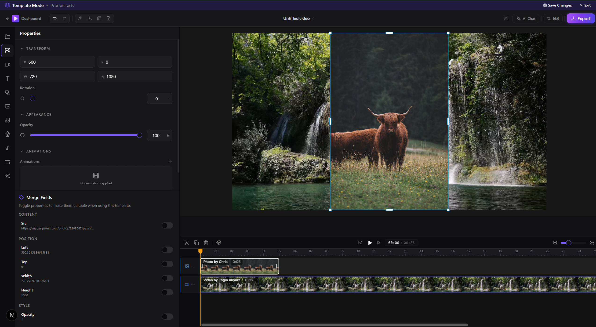
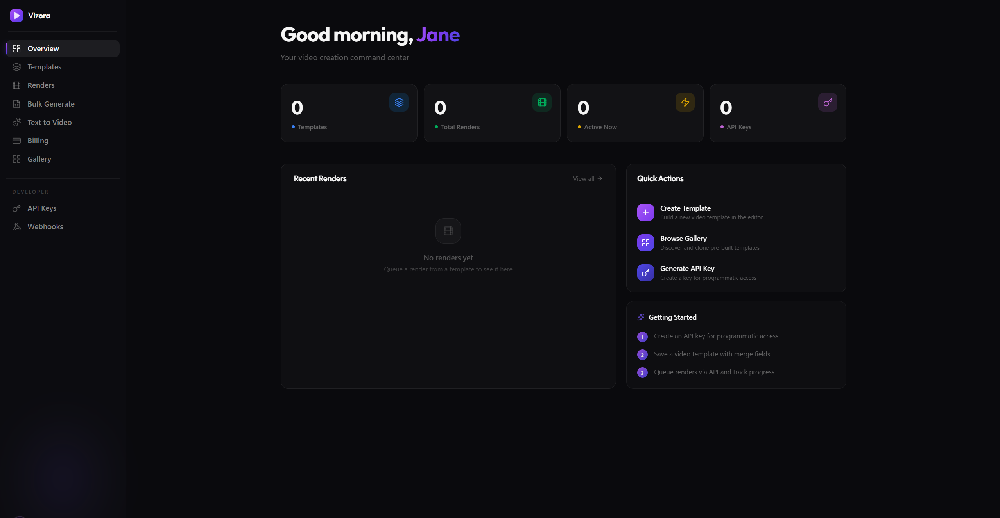

<p align="center">
  
</p>
<h1 align="center">Vizora</h1>

<p align="center">
AI-powered video creation platform — professional timeline editor meets intelligent automation.
</p>

<p align="center">
  <a href="https://vizora-editor.vercel.app">Live Demo</a>
</p>

---





## Features

- **Timeline Editor** — Multi-track video, audio, text, and effects on a precision timeline with drag-and-drop, trim, split, and resize.
- **AI Copilot** — Chat-based editing assistant that understands your vision. Describe changes in natural language.
- **Text to Video** — Generate complete videos from a text prompt. AI handles scripting, visuals, and narration.
- **Auto Captions** — AI-powered transcription with perfectly timed, styleable captions.
- **Template System** — Save and reuse templates with dynamic merge fields. Generate variations at scale from CSV.
- **REST API & Webhooks** — Programmatic access to rendering, templates, and generation with async webhook notifications.
- **Social Presets** — One-click export for TikTok, Reels, Shorts, and more at optimal formats and resolutions.
- **Stock Library** — Built-in access to millions of stock videos and images.

## Tech Stack

- **Next.js** — App router, server components, server actions
- **WebCodecs** — Hardware-accelerated video encoding/decoding in the browser
- **PixiJS** — 2D rendering engine for real-time preview and composition
- **Remotion** — Programmatic video generation with React
- **Prisma** — Database ORM
- **Better Auth** — Authentication with social providers
- **Stripe** — Billing and subscriptions

## Getting Started

```bash
# Install dependencies
pnpm install

# Start the development server
pnpm dev
```

## Project Structure

```
editor/                  # Next.js application
├── src/
│   ├── app/            # App router pages
│   │   ├── (marketing) # Landing page
│   │   ├── (auth)      # Login / signup
│   │   └── (protected) # Dashboard, editor
│   ├── components/     # Shared UI components
│   ├── lib/            # Utilities, auth, DB, Stripe
│   ├── remotion/       # Remotion video compositions
│   └── workers/        # Background workers
```

## License

See [LICENSE](LICENSE).
